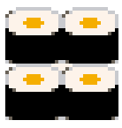
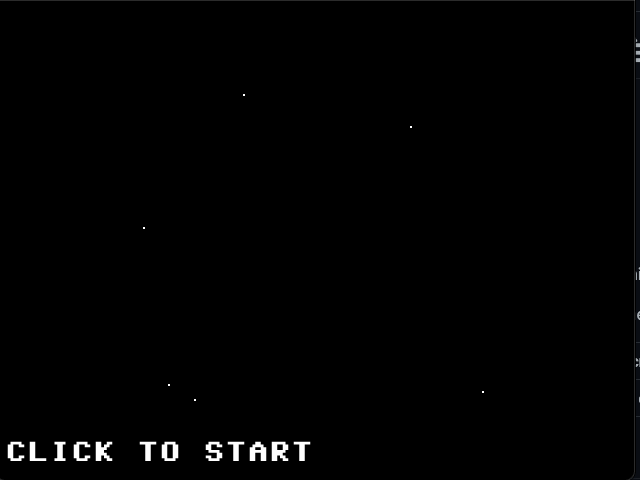

# べんとう(弁当) Bento



A collection of ebiten mini games

Below are a list of branches:

|branch|description|
|-|-|
|main|sandbox for experimenting|

## main



The sandbox currently has makings of a space shooter like an asteroids clone. To get started:

```bash
go get github.com/goshlanguage/bento
cd ~/go/src/github.com/goshlanguage/bento

go build main.go
./main
```
